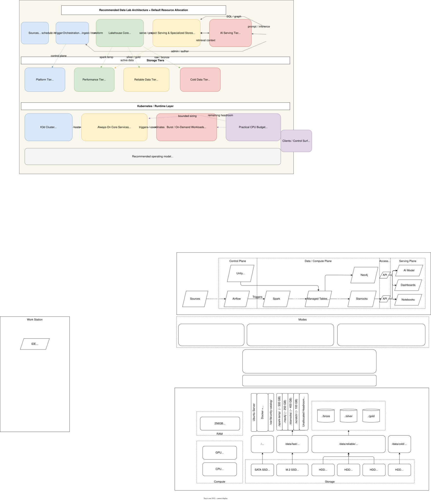

> This is part of an ongoing series: **Building a Personal Data Lab**.

# Designing the Data Lab Architecture

In the last post, I wrote about *why* I started building a personal data lab—to create a space where I could move faster, experiment freely, and better understand how modern data and AI systems behave in practice.

This post focuses on the design. Defining how the system is structured before a single component is deployed.

> **How I approached the architecture—and how those decisions were shaped by real constraints.**

This architecture mirrors many patterns seen in modern data platforms: a lakehouse core with decoupled storage and compute, multiple serving engines, and a governance layer abstracting access to data.

---

## Designing Under Constraint

This is not a cloud system.

There’s no autoscaling, no managed services, and no separation of concerns across clusters. Everything runs on a single machine:

- 16 cores / 32 threads  
- 256 GB RAM  
- 1 GPU (Nvidia Titan, 24 GB VRAM)  
- A mix of SSD, NVMe, and HDD storage  

That constraint fundamentally changes the problem.

Instead of asking:
> “What is the best architecture?”

The question becomes:
> **“What is the best architecture when everything shares the same CPU, memory, disk, and GPU?”**

Interestingly, designing under a single-node constraint makes tradeoffs more visible. The same challenges that exist at scale, like resource contention, workload isolation, and storage strategy, show up here in a more immediate and tangible way.

This led me to design around:

- contention  
- shared resources  
- operating modes  

Where I landed is captured in Figure 1. At a high level, the diagram reads left to right: data enters through ingestion, is processed into managed tables, and then branches into serving systems (SQL, graph, and AI). From top to bottom, the layers move from data flow, to operating modes, to underlying system configuration.

<figure markdown>
  
  <figcaption>Figure 1: A single-machine data lab architecture.</figcaption>
</figure>

---

## Walking the Architecture

Rather than thinking of the system as a collection of tools, I think of it as a **flow of data with clear control and serving boundaries**.

### From Sources to Processing

Data enters from external sources and is orchestrated by Airflow.

Airflow doesn’t process data—it coordinates work.

> **Spark is the primary processing engine**

Spark handles:

- ingestion  
- transformation  
- refinement  

and writes results into structured tables.

---

### The Lakehouse Core: Managed Tables

Instead of writing directly to storage in an ad hoc way, everything lands in:

> **Managed tables backed by MinIO and governed by Unity Catalog**

This enforces a clean separation of concerns:

- Storage → MinIO  
- Governance → Unity Catalog  
- Compute → Spark  

Treating data as managed tables rather than files is what allows multiple engines to work consistently over the same data without tight coupling or duplicated logic.

Unity Catalog introduces a governance layer over the data, allowing tables, objects, and AI/ML assets to be treated as managed, discoverable entities rather than raw files.

This becomes critical as multiple engines like Spark, StarRocks, and Neo4j interact with the same underlying data.

*Note (future work): Unity Catalog does not natively manage graph models or ontologies. I’ve been exploring what it would look like to extend this to support knowledge graph schema management.*

---

### Serving Paths: SQL and Graph

Once data is structured, it branches into two serving patterns.

**SQL Serving (StarRocks)**  
For analytical queries:
- Reads from managed tables  
- Exposes fast SQL access  

**Graph Projection (Neo4j via Spark)**  
For relationship-driven use cases:
- Spark projects data into a graph model  
- Neo4j serves graph queries  

This split is intentional:

> No single serving system is responsible for every access pattern.

SQL and graph systems can overlap in capability, but using each where it is strongest results in a cleaner and more maintainable architecture.

---

### The AI Layer

On top of the serving layer sits the AI model.

It consumes data from:

- Neo4j (graph-aware retrieval)  
- StarRocks (structured queries)  

This is where RAG and GraphRAG workflows live.

One key constraint:

> **The GPU is a single-tenant resource.**

When the model is active, it becomes the dominant workload on the system.

---

### Access Patterns

Dashboards, notebooks, and model interactions all go through service interfaces.

In practice, as a single-user lab, I often connect directly as an admin. Architecturally, however, I treat this as:

> **Clients interacting with platform services—not raw infrastructure**

---

## Storage Strategy: Performance vs Reliability

Storage became one of the more interesting design challenges.

I broke it into three tiers.

---

### Performance Tier (`/data/fast` – NVMe)

This is the working layer:

- Spark shuffle and temp data  
- Neo4j  
- StarRocks  
- scratch space  

This is where performance matters most.

One key lesson:

> **Leave space unused**

I intentionally keep ~400–600 GB free to absorb:
- Spark shuffle spikes  
- temporary workloads  

---

### Reliable Tier (`/data/reliable` – RAIDZ1)

This is where the core dataset lives.

Initially, I planned to use existing drives:

- 2 × 2TB HDD  
- 1 × 1TB HDD  

After thinking through failure modes, I added another 2TB drive and moved to:

> **RAIDZ1 (~4TB usable)**

This tier holds:

- bronze  
- silver  
- gold  

All layers of the lakehouse live here by default.

The reasoning is straightforward:
- maintain a consistent working dataset  
- enable reprocessing without re-ingestion  
- protect against single-drive failure  

Over time:

> **Bronze data is periodically offloaded to cold storage**

---

### Cold Tier (`/data/cold`)

This is the archive layer:

- older bronze data  
- raw ingestion history  
- inactive datasets  

The lifecycle becomes:

1. Data lands in bronze (reliable tier)  
2. Transforms produce silver and gold  
3. Older bronze data is moved to cold storage  

This keeps the reliable tier focused on active data.

---

## Designing Around Modes

A key shift in this design was moving away from static sizing toward **operating modes**.

---

### Mode 1: Processing Mode (Batch / ELT)

- Spark dominates  
- AI model is off  
- serving is minimal  

This is where pipelines are built and data is refined.

---

### Mode 2: GraphRAG / AI Mode (Interactive)

- AI model is active  
- Neo4j and/or StarRocks are active  
- Spark is off  

This is where exploration and retrieval workflows happen.

---

### Mode 3: Hybrid Mode (Constrained)

- AI model is on  
- serving is active  
- Spark is limited  

The rule is simple:

> Just because everything can run doesn’t mean it should

---

## Resource Allocation as a Design Constraint

Because everything shares the same hardware, resource allocation becomes part of the architecture.

A rough breakdown:

- Always-on services (MinIO, Airflow, light serving): ~4 CPU / ~32 GB RAM  
- Spark (batch mode): up to ~10–12 CPU / ~80–120 GB RAM  
- AI model (8B class): GPU (12–24 GB VRAM), ~2–4 CPU, ~16–32 GB RAM  

The guiding principle:

> **Only one heavy workload should dominate the system at a time**

---

## One Practical Decision: Jupyter Stays Local

Jupyter runs on my laptop and connects to the platform remotely.

Most development happens through Cursor + SSH, meaning:
- compute runs on the lab  
- iteration happens locally  

This keeps:
- cluster overhead low  
- resource usage predictable  
- development fast  

---

## What This Architecture Is (and Isn’t)

This is not:
- a production system  
- highly available  
- horizontally scalable  

This is:

> **A single-node, resource-constrained platform designed to explore modern data and AI patterns**

If it holds up in practice, I’ll have a platform that mirrors many of the same tradeoffs as large-scale systems—just compressed into a single machine.

---

## What I’m Still Figuring Out

The system isn’t running yet.

I’m still waiting on a few hardware components (most notably the CPU cooler), and there’s a non-trivial amount of setup ahead to get everything stable.

That’s intentional.

I wanted to think through:
- resource allocation  
- data flow  
- architectural tradeoffs  

before writing pipeline code.

Open questions remain:

- how well Spark and AI workloads coexist in practice  
- whether Neo4j and StarRocks both justify their footprint  
- how aggressively bronze data needs to move to cold storage

---

## What’s Next

The next step is turning this design into a working system—and seeing where it breaks.

This isn’t meant to be a perfect blueprint. It’s a deliberate design pass before implementation.

## Series: Building a Personal Data Lab

- Part 1: [Why I Built a Data Lab](data-lab-why.md)  
- Part 2: Designing the Data Lab Architecture *(this post)*  
- Part 3: Implementing the Data Lab *(coming next)*

→ Next: [Implementing the Data Lab](implementing-the-system.md)