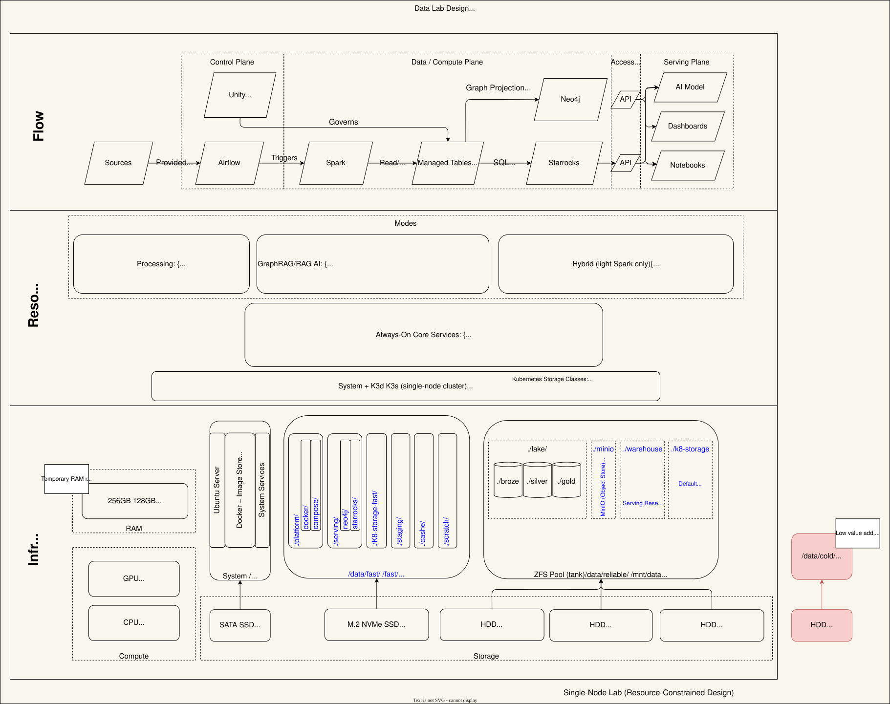

> This is part of an ongoing series: **Building a Personal Data Lab**.

# Implementing the Data Lab

In the last post, I walked through the architecture—how the system is designed, how resources are allocated, and how the components are intended to work together.

That was the design.

This is where that design meets reality.

---

## From Design to System

Over the past two weeks, I’ve been bringing the system online:

- assembling the hardware  
- configuring storage tiers  
- establishing the foundation of the platform  

And almost immediately, reality started pushing back.

Not unexpectedly—but in ways that forced decisions earlier than planned.

Some of the first adjustments came from:

- hardware behaving differently than expected  
- storage configuration changing under real constraints  
- clearer tradeoffs between system, fast, and durable storage  
- revisiting assumptions that didn’t hold up in practice  

> **The goal isn’t to perfectly implement the design—it’s to understand how it evolves under real constraints.**

The architecture provided direction.  
The system provided feedback.

---

## The First Lesson: Reality Doesn’t Match the Plan

The first step was straightforward in theory: assemble the hardware and bring the system online.

In practice, even that had friction.

This is my first time working with server hardware. Coming from consumer machines, I expected to interact with it the same way—plug in a monitor, boot, and start configuring.

That didn’t work.

The GPU didn’t output anything on boot. The motherboard only exposed VGA. That led me to something I hadn’t used before:

> **IPMI (Intelligent Platform Management Interface)**

Instead of interacting locally, I accessed the system over the network:

- connected via the IPMI port  
- identified the IP through my router  
- logged into the management interface  

From there, I had full remote control of the system—no monitor required.

That was the first shift in mindset:

> This isn’t a desktop. It’s infrastructure.

---

## Hardware Doesn’t Always Cooperate

After getting Ubuntu installed, I started seeing memory errors during boot.

What followed was a few hours of isolation and testing:

- rotating RAM across slots  
- validating stick vs slot behavior  
- narrowing down failure patterns  

The result:

> Two memory channels (B and D) appear to be non-functional.

That cut available memory in half—from 256 GB planned to 128 GB usable.


Not ideal, but still a significant step up from where I started. I also contacted the seller on eBay and shared my findings. They offered to send a replacement unit at no charge—special thanks to [athenaelectronics](https://www.ebay.com/usr/athenaelectronics).

This is one of those moments where the lab reinforces the point:

> **Design assumptions are only real once the system proves them out.**

---

## Storage: Design Meets Physical Constraints

Storage was one of the more thought-out parts of the architecture—and one of the first areas that changed.

### The 1TB Drive Decision

Originally, I planned to include a 1TB drive as a cold storage tier.

In practice:

- I had the slot  
- I didn’t have the power cable  
- and the value of that extra tier at this stage was limited  

So I made a tradeoff:

> Move the 1TB drive to my desktop instead

This simplified the server configuration and improved parity in my development environment.

---

### Rethinking Container Storage

Initially, I planned to use the SATA SSD for container runtime storage.

After revisiting that assumption, I moved it to the NVMe drive.

The reasoning was simple:

- lower latency  
- higher throughput  
- better alignment with platform workloads  

This led to a clearer storage model:

- **SATA SSD** → OS and system state  
- **NVMe** → serving workloads and fast runtime  
- **Durable pool** → lakehouse and object storage  

> **Where things live matters as much as what runs.**

---

### ZFS RAIDZ1: Waiting on Hardware & Data Migration

I had to wait a few days for the third 2TB HDD to arrive.

While waiting, I migrated everything off the existing drives to an external backup—primarily early music and audiobook collections.

Once the third 2TB drive arrived, I configured ZFS RAIDZ1.

> **ZFS RAIDZ1 on 3 × 2TB drives**

This preserved the durable storage layer and added:

- checksumming  
- compression  
- improved long-term data management  

The durable layer is now organized as:

```
/mnt/data/
lake/
minio/
k8s-storage/
warehouse/
```

The `warehouse/` path is reserved for future use (backups, exports), not primary serving.


---

## Platform Direction: K3d vs K3s

Before starting this build, I had been using k3d on my development machine.

That assumption carried forward—until I asked:

> “Why k3d instead of k3s?”

There wasn’t a strong answer.

On a single-node server:

- k3s is simpler  
- closer to real-world deployments  
- removes an unnecessary abstraction  

So I shifted:

> **From k3d → to k3s**

---

## Kubernetes Storage Became a Real Architecture Decision

Once k3s was running, storage stopped being theoretical.

I didn’t want Kubernetes treating all storage the same, because the system doesn’t.

So I defined two storage classes:

- **`local-path`** → `/mnt/data/k8s-storage` (durable, default)  
- **`local-path-fast`** → `/fast/k8s-storage-fast` (NVMe)  

This creates a clear contract:

- durable workloads land on ZFS  
- performance-sensitive workloads opt into NVMe  

> This is where the architecture stops being conceptual.

Storage tiering is no longer a diagram—it’s enforced by the platform.

---

## A Pattern Emerges

At this point, a consistent pattern started to show up:

1. Define the architecture  
2. Start implementation  
3. Hit a constraint  
4. Adjust the system  
5. Refine the architecture  

> **The architecture isn’t a blueprint. It’s a hypothesis.**

And implementation is the experiment.

---

## What Held vs What Changed

### What held

- overall system structure  
- storage tiering as a core principle  
- separation of system, fast, and durable layers  
- Kubernetes as the platform foundation  

### What changed

- available memory (hardware limitation)  
- removal of the 1TB cold tier  
- container runtime placement (SATA → NVMe)  
- Kubernetes approach (k3d → k3s)  
- storage implementation (directory structure)
- explicit storage classes for tiering  

A redline of the planned architecture is captured in Figure 2.

<figure markdown>
  
  <figcaption>Figure 2: Redlined architecture reflecting implementation changes.</figcaption>
</figure>

---

## Where the System Is Now

At this point:

- hardware is assembled and accessible  
- base OS is installed  
- storage tiers are configured  
- a K3s cluster is running  
- storage classes are defined  

What’s not in place yet:

- Full 256 GB RAM (pending motherboard replacement)
- MinIO  
- Airflow  
- Spark  
- Neo4j  
- StarRocks  
- ingestion pipelines  

This phase was about getting to a stable foundation.

---

## What This Phase Taught Me

The biggest takeaway so far:

> **Constraints show up faster—and more honestly—on a single machine.**

There’s no abstraction layer hiding them.

- hardware limits are immediate  
- storage tradeoffs are visible  
- architectural decisions surface quickly  

These are the same tradeoffs that show up in larger systems:

- performance vs durability  
- flexibility vs structure  
- simplicity vs control  

The difference here is that nothing is hidden. This is an unplanned benefit of the lab.

There’s nothing that accelerates learning like a Gemba-style “go and see.” Starting from bare metal and working upward through the system exposes every layer of the stack in a way abstractions often hide.

---

## What’s Next

The next step is moving from a running system to a usable platform:

- hardware failure exercise: transitioning to the new motherboard   
- deploying core services  
- validating behavior under real workloads  
- building the first end-to-end data flow  

That’s where the system starts to look less like infrastructure—and more like a data platform.

---

## Series: Building a Personal Data Lab

- Part 1: [Why I Built a Data Lab](data-lab-why.md)  
- Part 2: [Designing the Data Lab Architecture](data-lab-architecture.md)  
- Part 3: Implementing the Data Lab *(this post)*  

→ Next: [Validating the Platform Under Change](validating-the-platform-under-change.md) *(coming next)*